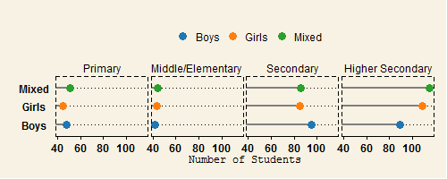

## PITCH PROJECT

This is my reproducible pitch presentation, where I describe what I did in my simple app project.

The project is regarding the education in situation. The application shows some basic ratio such as 

1. Student to teacher ratio,
2. Student to class ratio and
3. Student to school ratio. 

--- .class #id 

## Data Description

```
## 'data.frame':	72 obs. of  5 variables:
##  $ district  : Factor w/ 2 levels "larkana","thatta": 1 1 1 1 1 1 1 1 1 1 ...
##  $ factor    : Factor w/ 3 levels "class","school",..: 1 1 1 1 1 1 1 1 1 1 ...
##  $ gender    : Factor w/ 3 levels "Boys","Girls",..: 1 2 3 1 2 3 1 2 3 1 ...
##  $ level     : Factor w/ 4 levels "Higher Secondary",..: 3 3 3 2 2 2 4 4 4 1 ...
##  $ percentage: num  47.8 44.8 51 42.1 43.6 ...
```
 The Data contains five variables;
 
1. Districts
2. Factors
3. Gender
4. Education Level
5. Value in Percentage


--- .class
## How does the application Works

1. Select the district
2. select the Education measure for the above selected district

The output is in the form of multi-faceted graph. It shows the ratio for gender type schools i.e either boys only schools/ girls only schools or non-segregated schools. For each of these value it shows for tier of education i.e primary, middle, secondary and higher secondary


--- .class

## Output(Graph
)

